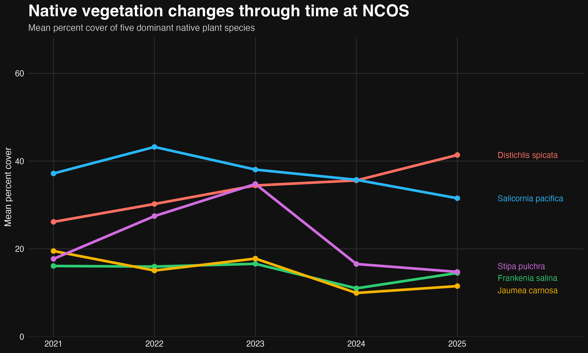

# intermediate-elective-02

## General information

This repository contains data, code, and visualizations for the Intermediate Elective assignment for Spring 2026. The project explores long-term native vegetation trends at NCOS (North Campus Open Space) between 2021 and 2025 using a visualization inspired by Steven Ponce’s “Coal falls. Renewables rise.”

To work with the code in this repository, you will need the following packages:

```
library(tidyverse)
library(janitor)
library(here)
library(lubridate)
library(ggtext)
library(ggrepel)
```

## Data and file information

```
.
├── README.md
├── code
│   ├── Cutner-Nina_Intermediate-elective-02.qmd
│   └── Cutner-Nina_Intermediate-elective-02.pdf
├── data
│   └── veg copy.csv
├── figures
│   ├── native-vegetation-trends.png
│   └── sketch.jpg
└── intermediate-elective-02.Rproj
```

### Data descriptions

- `veg copy.csv` contains vegetation monitoring data collected at North Campus Open Space (NCOS) between 2021 and 2025. Variables include year, plant species (`psoc`), percent cover, and vegetation classifications used to analyze long-term native vegetation trends.

### Code and figure information

- `Cutner-Nina_Intermediate-elective-02.qmd` contains all code used for data cleaning, visualization, and analysis.

- `native-vegetation-trends.png` is the final Ponce-inspired visualization showing changes in native vegetation cover through time at NCOS.

## Rendered output

The rendered assignment for the code in this repository can be viewed [here](code/Cutner-Nina_Intermediate-elective-02.pdf).

## Final visualization

